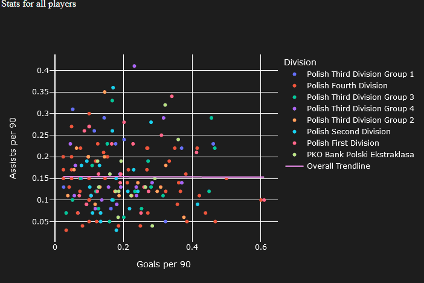
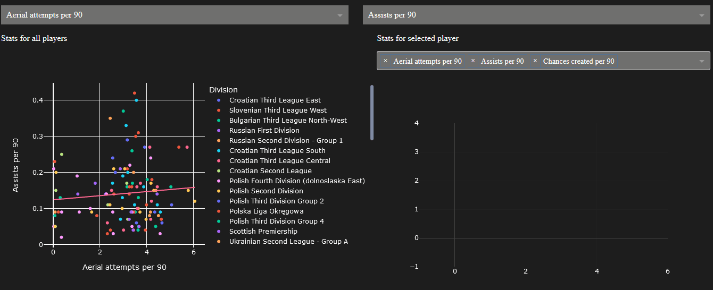
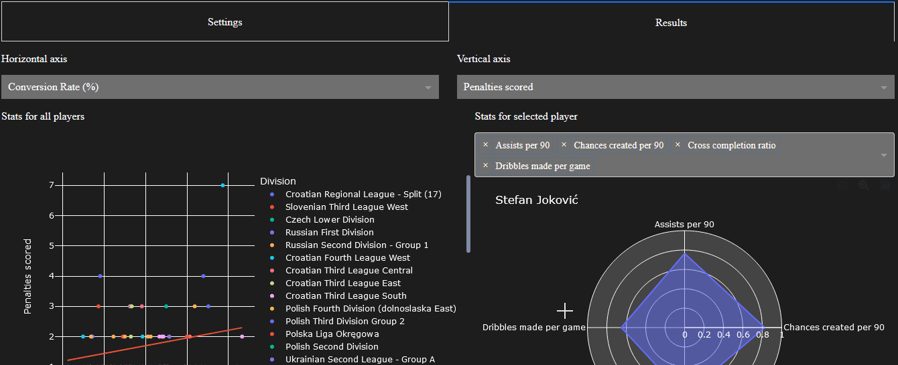
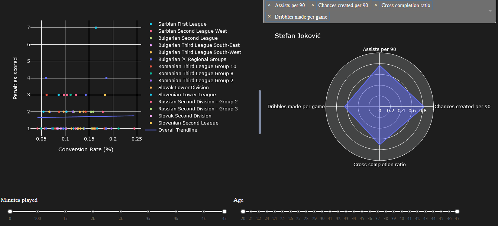

# FM Stats Tool

FM Stats Tool is a Dash app for visualizing player stats from Football Manager game series.

# How to use this

## Get custom views

1. Get .fmf files for your version from /views directory in this repo
2. Copy and paste them into views directory (usually C:\Users\[USERNAME]\Documents\Sports Interactive\Football Manager 202*\views)

## Get data from your save

1. Open the game, load your save and navigate to **Scouting->Players->Player Search**
2. Import custom view - click on the eye icon to expand dropdown menu and pick **Import view**
3. Generate HTML file with the search results via **FM->Print Screen->Web Page**
4. Convert HTML to CSV for example using this converter:
https://www.convertcsv.com/html-table-to-csv.htm

## Run this app

1. Open command line
2. Navigate to project directory
3. Execute python script
```bash
python3 app.py
```
4. Open localhost:8080 in your browser

## Load data, use app

1. In 'Settings' tab drag and drop .csv file or click 'Select File' and pick your file
2. Adjust game version and penalty switches. 
3. Go to 'Results' tab
4. Adjust 'Minutes played' and 'Age' sliders
5. Pick stats to plot on a scattergram using dropdowns at the top
6. Review divisions to the right of the scattergram, exclude or reinclude by clicking them
7. Clicking on dots on a scattergram will display a radar chart comparing a given player with the rest of the set (metrics can be adjusted via multi-choice dropdown above spider chart)






# What stats are included?
Supported stats are as follows:
- Average rating 
- Conversion Rate (%) 
- Cross completion ratio 
- Headers won ratio 
- Pass completion ratio 
- Shots on target ratio 
- Tackles won ratio 
- xG per 90*
- Goals per 90
- Assists per 90
- Crosses completed per 90 
- Crosses attempted per 90 
- Clear cut chances created per 90* 
- Aerial attempts per 90 
- Dribbles made per game 
- Key passes per 90 
- Key tackles per 90 
- Key headers per 90 
- Shots on target per 90 
- Passes completed per 90 
- Passes attempted per 90 
- Headers won per 90 
- Shots per 90 
- Tackles won per 90 
- Distance per 90 
- Interceptions per 90 
- Tackles attempted per 90 
- Chances created per 90 
- Offsides per 90 
- Mistakes leading to goal per 90 
- Fouls per 90
- Penalties 
- Penalties scored 


*Indicates stats available only for datasets from 2021 version of the game
# What stats are affected by penalty switch?

xG per 90 - if penalties are included it's equal to the value from game. Otherwise xG per 90 is recalculated using this formula:

$$xgpm = (xg - 0.76p)/(min/90)$$ 
Where:
- xgpm - xG per 90
- xg - combined xG from all appereances
- p - amount of penalty shots taken (xG for every penalty shot is 0.76)
- minutes played

Goals per 90 if penalties are included it's equal to the value from game. Otherwise Goals per 90 are recalculated using this formula:

$$gpm = (g - ps)/(min/90)$$
Where:
- gpm - Goals per 90
- g - goals in all appereances
- ps - amount of penalties scored
- minutes played

Conversion Rate - if penalties are included it's equal to the value from game. Otherwise conversion rate is recalculated using this formula:

$$cr = (g - ps)/(sh - p)$$

Where:
- cr - Conversion Rate
- g - goals in all appereances
- ps - amount of penalties scored
- sh - shots in all appereances
- p - amount of penalty shots taken

# How does radar chart comparison work?

Values 0 to 1 represent percentiles, so that 0.99 is 99th percentile (meaning that 99% of players have worse (usually smaller) value for a given metric).

Set of players for comparison is affected by:
- Players excluded by minutes slider
- Players who have value of 0 for either metric represented on scattergram

Set of players for comparison is NOT affected by:
- Players excluded by age slider
- Players excluded by excluding divisions on the scattergram figure


